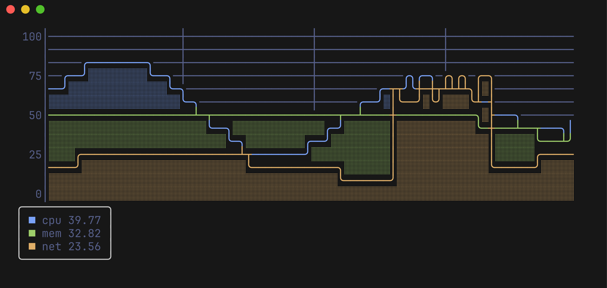
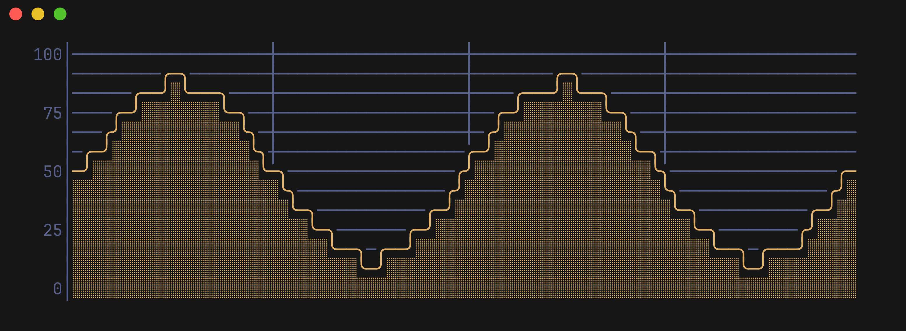
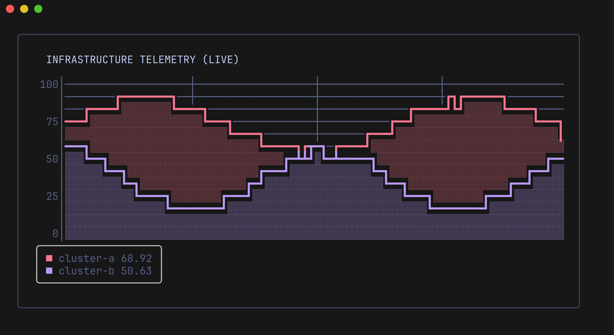
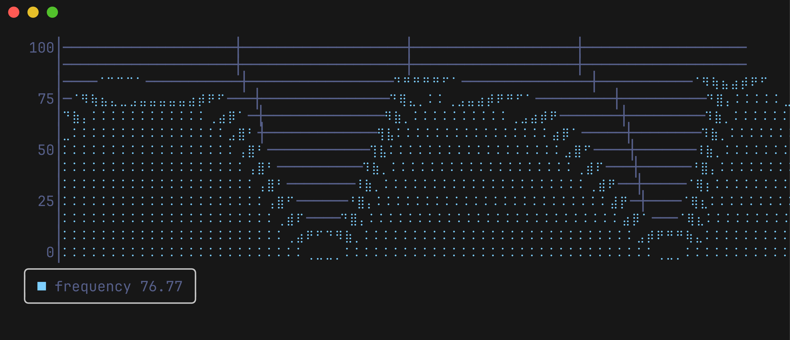

# Pulse

<p align="center">
  
</p>

<p align="center">
  <strong>Real-time terminal line charts for Charm Lip Gloss and Bubble Tea.</strong>
</p>

<p align="center">
  <a href="https://github.com/ingvarch/pulse/actions/workflows/ci.yml"></a>
  <a href="https://pkg.go.dev/github.com/ingvarch/pulse"></a>
  <a href="https://goreportcard.com/report/github.com/ingvarch/pulse"></a>
  <a href="LICENSE"></a>
</p>

---

<p align="center">
  
</p>

**Pulse** brings rich, responsive time-series visualization to terminal user interfaces (TUIs). Built specifically for the [Charm](https://charm.sh) ecosystem ([Lip Gloss](https://github.com/charmbracelet/lipgloss) and [Bubble Tea](https://github.com/charmbracelet/bubbletea)), Pulse features smooth box-drawing curves, high-density Braille sub-pixel rendering, half-tone shaded area fills, and Grafana-style aligned gridlines.

## ✨ Features

- **╭╯ Smooth Box-Drawing**: Continuous lines rendered with rounded arcs (`╭ ╮ ╯ ╰`) or bold strokes (`┏ ┓ ┛ ┗`).
- **⠒ Sub-Pixel Braille**: High-density 2×4 dot Braille matrix interpolated via cubic **Catmull-Rom splines**.
- **░ Shaded Area Fill**: Half-tone shading beneath curves that cleanly absorbs grid intersections.
- **┼ Aligned Coordinate Grid**: Subtle coordinate grid aligned exactly to Y-axis ticks and width quarter-steps.
- **📈 Multi-Series Support**: Plot multiple named metrics simultaneously with dedicated styles and swatches.
- **📦 Live Legend Box**: Bordered legend overlay displaying swatches, names, and real-time values.
- **🫧 Charm Native**: Fully customizable with Lip Gloss styles and built for Bubble Tea event loops.

## 🚀 Quick Start

### Installation

```bash
go get github.com/ingvarch/pulse
```

### Minimal Example

```go
package main

import (
	"fmt"
	"math"

	"github.com/ingvarch/pulse"
	"github.com/ingvarch/pulse/theme"
)

func main() {
	preset := theme.TokyoNight()
	chartW, chartH := 80, 13

	chart := pulse.New(chartW, chartH,
		pulse.WithRange(0, 100),
		pulse.WithTicks(0, 25, 50, 75, 100),
		pulse.WithLineWidth(1), // Smooth rounded corners: ╭ ╮ ╯ ╰
		pulse.WithAxisStyle(preset.Axis),
		pulse.WithLineStyle(preset.LineFor(60)),
	)

	// Stream 80 data points into the sliding window
	for i := 0; i < chartW; i++ {
		val := 50 + 38*math.Sin(float64(i)*0.16)
		chart.Push(val)
	}

	fmt.Println(chart.View())
}
```

<p align="center">
  
</p>

## 🎨 Lip Gloss Styling & Themes

Pulse is designed from the ground up for [Lip Gloss](https://github.com/charmbracelet/lipgloss). You can style individual series, axes, borders, and threshold colors:

```go
package main

import (
	"fmt"
	"charm.land/lipgloss/v2"
	"github.com/ingvarch/pulse"
	"github.com/ingvarch/pulse/theme"
)

func main() {
	preset := theme.TokyoNight()

	chart := pulse.New(80, 13,
		pulse.WithRange(0, 100),
		pulse.WithTicks(0, 25, 50, 75, 100),
		pulse.WithLineWidth(2), // Bold curves: ┏ ┓ ┛ ┗
		pulse.WithAxisStyle(preset.Axis),
		pulse.WithSeriesStyle("cluster-a", preset.LineFor(88.0)), // Red warning threshold
		pulse.WithSeriesStyle("cluster-b", lipgloss.NewStyle().Foreground(lipgloss.Color("#bb9af7"))),
	)

	// Wrap the chart in a Lip Gloss bordered container
	box := lipgloss.NewStyle().
		Border(lipgloss.RoundedBorder()).
		BorderForeground(lipgloss.Color("#3b4261")).
		Padding(1, 2).
		Render(chart.View() + "\n" + chart.LegendBox())

	fmt.Println(box)
}
```

<p align="center">
  
</p>

## ⠒ Braille Sub-Pixel Rendering

For ultra-dense metrics, switch to `pulse.ModeBraille` to enable 2×4 dot matrix sub-pixel resolution powered by cubic Catmull-Rom spline interpolation:

```go
chart.SetMode(pulse.ModeBraille)
```

<p align="center">
  
</p>

## 📚 Documentation

Detailed guides and API references are available in the [docs](docs/) directory:

| Document | Description |
| -------- | ----------- |
| [**Getting Started**](docs/getting-started.md) | Constructor options, sliding window buffers, multi-series, and runtime controls |
| [**Rendering Modes**](docs/rendering-modes.md) | Box-drawing curves (rounded vs bold), Braille sub-pixel matrix, and area fill |
| [**Axes & Grid**](docs/axes-and-grid.md) | Adaptive NiceTicks, custom tick quarter-steps, and Grafana grid alignment |
| [**Bubble Tea Integration**](docs/bubbletea.md) | Embedding in Bubble Tea models, telemetry ticks, and interactive hotkeys |

## 🎮 Interactive Demos

Try the included examples directly from your terminal:

```bash
# Live multi-series stream (CPU, MEM, NET) with hotkeys: t (thickness), m (braille), q (quit)
go run ./examples/multidemo

# Live single-signal generator with thickness & mode toggle
go run ./examples/livedemo

# Real-time hardware telemetry (CPU & RAM) from your machine
go run ./examples/cpulive

# Clean terminal screenshot generator
go run ./examples/cpudemo
```

## 🤝 Community & Contributing

We welcome issues and pull requests! Please check our community guidelines:

- [Contributing Guide](CONTRIBUTING.md)
- [Code of Conduct](CODE_OF_CONDUCT.md)
- [Security Policy](SECURITY.md)

## 📄 License

Pulse is licensed under the [MIT License](LICENSE).
