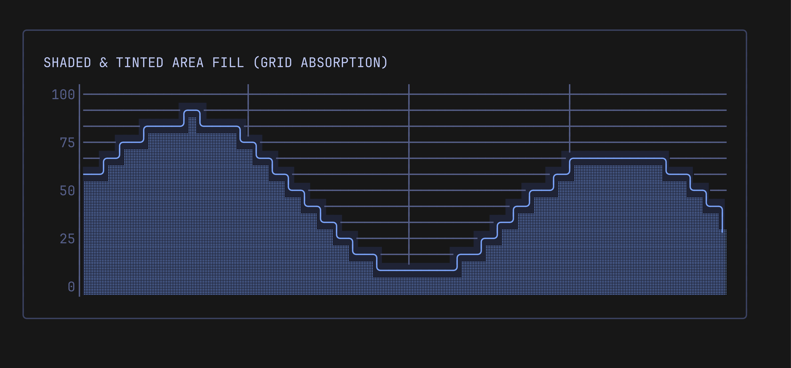

# Rendering Modes & Curve Styles

Pulse supports two distinct rendering engines:

1. **`pulse.ModeLines`**: Continuous Unicode box-drawing characters with smooth rounded arcs or bold turns, plus half-tone area fill.
2. **`pulse.ModeBraille`**: Sub-pixel 2×4 dot Braille matrix for high-density curves.

---

## 1. Box-Drawing Lines (`ModeLines`)

`ModeLines` (default) converts time-series points into continuous connected strokes. Every cell determines its incoming and outgoing directions to select the exact glyph.

### Rounded Curves (Line Width 1)

When `pulse.WithLineWidth(1)` (default) and smoothing are enabled, turns use rounded arcs:

| Character | Name | Use Case |
| --------- | ---- | -------- |
| `╭` | Upper-left arc | Line curving downwards towards the right |
| `╮` | Upper-right arc | Line curving downwards towards the left |
| `╰` | Lower-left arc | Line curving upwards towards the right |
| `╯` | Lower-right arc | Line curving upwards towards the left |
| `─` | Horizontal | Flat segments |
| `│` | Vertical | Rapid elevation changes |

<p align="center">
  
</p>

### Bold Curves (Line Width 2)

For a bolder, punchy aesthetic:
```go
chart.SetLineWidth(2)
```
Uses heavy box-drawing glyphs: `┏`, `┓`, `┗`, `┛`, `━`, `┃`.

<p align="center">
  
</p>

### Shaded & Tinted Area Fill (`░`)

Enable area fill under curves with:
```go
pulse.WithFill(true)
pulse.WithTintedFill(true) // seamlessly bridges the gap between line curves and fill
pulse.WithSolidFill(false) // false: stippled "░", true: solid background surface
pulse.WithTintColor(color) // optional custom tint color; defaults to Tokyo Night slate #1f2335
```
- **Shading (`░`)**: Extends from the underside of the curve down to the baseline (`0.0`).
- **Tinted Fill (`WithTintedFill`)**: Applies a continuous background tone across both the line cells and the fill cells. This completely eliminates the dark horizontal gap under box-drawing glyphs and gives the fill area a luminous, unified depth.
- **Solid Fill (`WithSolidFill`)**: When enabled alongside `WithTintedFill`, turns the area under the curve into a pure solid background surface rather than stippled dots.
- **Custom Tint (`WithTintColor`)**: Overrides the default Tokyo Night slate (`#1f2335`) with any custom color or palette surface.
- Grid lines (`┼`, `│`) that fall inside filled regions are cleanly absorbed so the shaded fill stays crisp and uniform without visual glitches.

<p align="center">
  
</p>

---

## 2. Braille Matrix (`ModeBraille`)

For ultra-dense plots or small terminal dimensions, Braille mode quadruples vertical resolution and doubles horizontal resolution by utilizing the Unicode Braille Patterns matrix (`U+2800`–`U+28FF`).

- **Grid Resolution**: Each character cell represents a 2×4 dot sub-grid.
- **Smoothing**: Uses cubic **Catmull-Rom splines** to interpolate between discrete data points, producing silky-smooth organic curves.

```go
chart.SetMode(pulse.ModeBraille)
```

<p align="center">
  
</p>

You can toggle between modes interactively with `chart.ToggleRenderMode()`.
