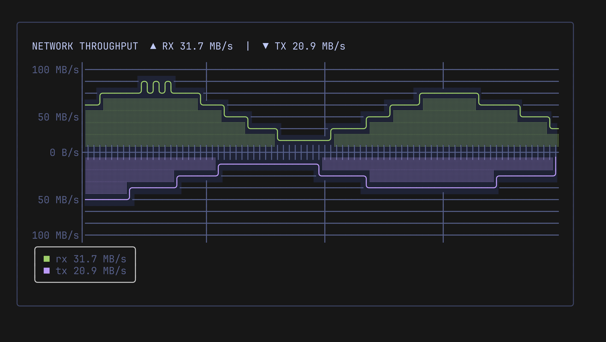
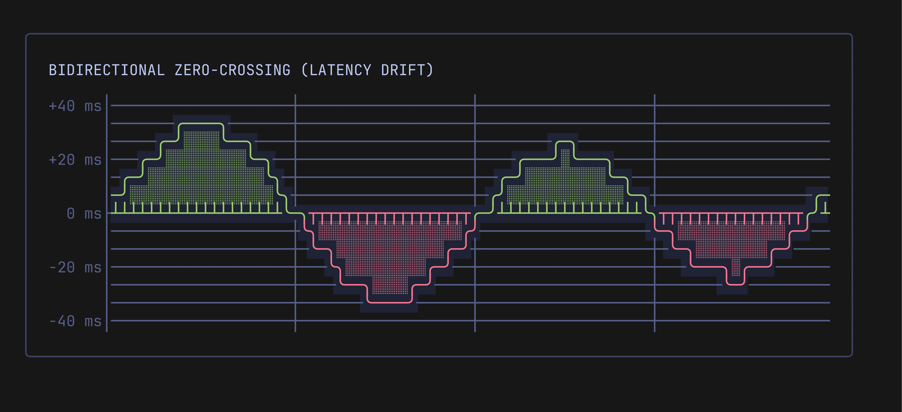

# Bidirectional Zero-Crossing Fill & RX/TX Traffic

Pulse features first-class support for **Grafana-style bidirectional charts**, allowing metrics with both positive and negative values to be visually anchored around a central **Zero Baseline** ($Y = 0$).

This capability is essential for modern terminal dashboards monitoring:
* **Network Throughput (RX / TX)**: Incoming traffic above the baseline, outgoing traffic mirrored below the baseline.
* **Latency Deltas & Drift**: Positive spikes indicate degradation; negative values indicate performance improvements.
* **Financial & Trading Metrics (P&L / Cash Flow)**: Gains rendered in green above zero, losses rendered in red below zero.
* **Queue / Buffer Dynamics**: Queue accumulation rate ($> 0$) vs drain rate ($< 0$).

<p align="center">
  
</p>

---

## 🎯 The Problem with Bottom-Anchored Fill

In traditional terminal charting libraries, area fill (`░`) is unconditionally anchored to the bottom edge of the plot. When visualizing metrics that cross zero:
1. Negative values are filled down to the minimum Y-bound, making large negative spikes look visually inverted.
2. The zero threshold ($0.0$) disappears into the background grid without any clear boundary.
3. Both positive and negative values share the same line color, obscuring critical phase changes.

Pulse resolves this by introducing **Bidirectional Zero-Crossing Fill**, where positive values fill downward to $Y=0$ (`┴`), negative values fill upward to $Y=0$ (`┬`), and the zero boundary itself acts as a prominent baseline ruling (`├`).

---

## 📐 Anatomy of the Zero Baseline

When `pulse.WithZeroBaseline(true)` is enabled:

<p align="center">
  
</p>

* **Y-Axis Divider (`├`)**: Replaces the regular axis bar `│` at row $Y = 0$, clearly anchoring the zero point.
* **Baseline Ruling (`─`)**: Empty cells at $Y = 0$ render a solid baseline line, colored with `axisStyle`.
* **Positive Fill Connectors (`┴`)**: Connect positive curves and area fill seamlessly to the baseline, inheriting the positive series color.
* **Negative Fill Connectors (`┬`)**: Connect negative curves and area fill seamlessly to the baseline, inheriting the negative series color.
* **Bi-directional Intersections (`┼`)**: When both positive and negative series occupy the same column at the baseline.

---

## 📦 API & Configuration Options

### Functional Options

| Option | Description |
| :--- | :--- |
| `pulse.WithZeroBaseline(on bool)` | Enables or disables explicit zero baseline rendering (`├` on Y-axis and baseline ruling at $Y=0$). |
| `pulse.WithSymmetric(on bool)` | Normalizes the Y range to be symmetric around zero ($[-\text{limit}, +\text{limit}]$), centering the zero baseline vertically. |
| `pulse.WithNegativeStyle(s lipgloss.Style)` | Sets the style for negative values ($< 0$) of the default series. |
| `pulse.WithSeriesNegativeStyle(name string, s lipgloss.Style)` | Sets the style for negative values ($< 0$) of a named series. |
| `pulse.WithSeriesInverted(name string, inverted bool)` | Automatically inverts values when plotted ($v \to -v$). Raw positive values are preserved in `Last()` and data storage. |
| `pulse.WithInverted(inverted bool)` | Inverts the default series when plotted ($v \to -v$). |

### Runtime Model Methods

| Method | Description |
| :--- | :--- |
| `chart.SetZeroBaseline(on bool)` | Dynamically toggles zero baseline rendering. |
| `chart.ZeroBaseline() bool` | Returns whether zero baseline rendering is enabled. |
| `chart.SetSymmetric(on bool)` | Dynamically toggles symmetric range normalization around zero. |
| `chart.Symmetric() bool` | Returns whether symmetric range normalization is enabled. |
| `chart.SetNegativeStyle(s lipgloss.Style)` | Dynamically sets negative line and fill style for default series. |
| `chart.NegativeStyle() lipgloss.Style` | Returns negative style for default series. |
| `chart.SetSeriesNegativeStyle(name string, s lipgloss.Style)` | Dynamically sets negative style for a named series. |
| `chart.SeriesNegativeStyle(name string) lipgloss.Style` | Returns negative style for a named series. |
| `chart.SetSeriesInverted(name string, inverted bool)` | Dynamically toggles value inversion for a named series. |
| `chart.SeriesInverted(name string) bool` | Returns whether value inversion is active for a named series. |

---

## ⚖️ Auto-Symmetric Range & Centered Zero Baseline

In mirror charts like RX/TX network traffic, Read/Write disk IO, or Long/Short positions, you typically want the zero baseline to be anchored **directly in the center** of the plot area, with equal vertical headroom for both directions.

Enabling `pulse.WithSymmetric(true)` (or dynamically via `chart.SetSymmetric(true)`) automatically normalizes the Y range bounds to:
$$[-\text{limit}, +\text{limit}] \quad \text{where} \quad \text{limit} = \max(|min|, |max|)$$

For example, an asymmetric input like `WithRange(-20, 80)` is automatically normalized to `[-80, 80]`. On a chart of height 9, row index 4 ($(9-1)/2 = 4$) becomes the exact vertical center for the zero baseline ruling (`├`), ensuring identical headroom and scaling for both ingress and egress spikes.

Whenever you push data or adjust limits with `chart.SetRange(min, max)`, Pulse ensures the bounds remain balanced around zero without manual recalculations.

---

## 📊 Adaptive Byte & Throughput Rate Formatting (`scale`)

Pulse includes high-performance formatters for byte counts and transfer rates in the `github.com/ingvarch/pulse/scale` package:

| Function | Output Example | Typical Use Case |
| :--- | :--- | :--- |
| `scale.FormatBytes(v float64)` | `"512 B"`, `"1.5 KB"`, `"10 MB"`, `"2 GB"` | Memory, Disk storage |
| `scale.FormatBytesRate(v float64)` | `"1 KB/s"`, `"50 MB/s"`, `"-50 MB/s"` | Signed network & IO throughput |
| `scale.FormatBytesRateAbs(v float64)` | `"1 KB/s"`, `"50 MB/s"`, `"50 MB/s"` | Mirrored Y-axis labels without negative sign |
| `scale.BytesRateFormatter(abs bool)` | Returns `func(float64) string` | Direct drop-in for `pulse.WithLabelFormatter(...)` |

### Mirrored Y-Axis Labels
When plotting inverted TX traffic below the baseline, negative values like `-50 MB/s` are conceptually positive egress bandwidth. By passing `scale.BytesRateFormatter(true)`, both upper (RX) and lower (TX) ticks render as positive rates:

```go
pulse.WithLabelFormatter(scale.BytesRateFormatter(true))
// Renders:
//  +100 MB/s │
//   +50 MB/s │
//     0 B/s  ├
//   +50 MB/s │
//  +100 MB/s │
```

---

## ✨ Rounded Corners & Smooth Curves

Pulse supports smooth continuous box-drawing curves across both positive and negative coordinates:

* **Thin Lines (`pulse.WithLineWidth(1)`)**:
  * Positive peaks form smooth top arcs: `╭───╮`
  * Negative troughs form smooth bottom arcs: `╰───╯`
  * Zero crossings form smooth S-curves: `╮` $\to$ `╰` or `╭` $\to$ `╯`
* **Bold Lines (`pulse.WithLineWidth(2)`)**:
  * Heavy box-drawing characters (`┏`, `┓`, `┗`, `┛`, `┃`, `━`).
* **Sharp Lines (`pulse.WithSmooth(false)`)**:
  * Crisp 90° angular corners (`┌`, `┐`, `└`, `┘`).

> [!TIP]
> To display thin rounded corners (`╭`, `╮`, `╯`, `╰`), specify `pulse.WithLineWidth(1)`. Standard Unicode defines rounded box characters only for thin line weights.

---

## 💡 Practical Examples

### 1. Network RX / TX Traffic (Grafana Pattern)

In this pattern, both RX and TX data are received as raw bytes per second (e.g. `50 * 1024 * 1024`). By configuring `WithSeriesInverted("tx", true)` and `WithSymmetric(true)`, TX is automatically mirrored below the baseline while retaining its positive magnitude for stats and headers:

```go
package main

import (
	"fmt"
	"math"

	"charm.land/lipgloss/v2"
	"github.com/ingvarch/pulse"
	"github.com/ingvarch/pulse/scale"
	"github.com/ingvarch/pulse/theme"
)

const MB = 1024 * 1024

func main() {
	preset := theme.TokyoNight()

	chart := pulse.New(60, 13,
		pulse.WithLineWidth(1), // Thin rounded curves: ╭ ╮ ╯ ╰
		pulse.WithRange(0, 100*MB),
		pulse.WithSymmetric(true), // Automatically centers zero: [-100 MB, +100 MB]
		pulse.WithZeroBaseline(true),
		pulse.WithTicks(-100*MB, -50*MB, 0, 50*MB, 100*MB),
		pulse.WithLabelFormatter(scale.BytesRateFormatter(true)), // Mirrored absolute labels: 50 MB/s
		pulse.WithSeriesStyle("rx", lipgloss.NewStyle().Foreground(lipgloss.Color("#9ece6a"))), // Green (RX)
		pulse.WithSeriesStyle("tx", lipgloss.NewStyle().Foreground(lipgloss.Color("#bb9af7"))), // Purple (TX)
		pulse.WithSeriesInverted("tx", true),                                                   // Auto-mirror TX below zero
		pulse.WithAxisStyle(preset.Axis),
		pulse.WithFill(true),
		pulse.WithTintedFill(true),
	)

	// Stream sample traffic points in bytes/second
	for i := 0; i < 60; i++ {
		rx := (45.0 + 35.0*math.Sin(float64(i)*0.15)) * MB
		tx := (30.0 + 25.0*math.Cos(float64(i)*0.12)) * MB
		chart.PushSeries("rx", rx)
		chart.PushSeries("tx", tx)
	}

	rxVal, _ := chart.Last("rx")
	txVal, _ := chart.Last("tx")

	fmt.Printf("Current: ▲ RX %s  |  ▼ TX %s\n\n", scale.FormatBytesRate(rxVal), scale.FormatBytesRate(txVal))
	fmt.Println(chart.View())
	fmt.Println(chart.LegendBox())
}
```

<p align="center">
  
</p>

---

### 2. Single-Series Zero-Crossing (P&L / Latency Delta)

For a single metric that fluctuates above and below zero, use `WithNegativeStyle` to automatically paint positive values green and negative values red:

```go
package main

import (
	"fmt"
	"math"

	"charm.land/lipgloss/v2"
	"github.com/ingvarch/pulse"
)

func main() {
	green := lipgloss.NewStyle().Foreground(lipgloss.Color("#9ece6a"))
	red := lipgloss.NewStyle().Foreground(lipgloss.Color("#f7768e"))

	chart := pulse.New(50, 11,
		pulse.WithLineWidth(1),
		pulse.WithRange(-40, 40),
		pulse.WithZeroBaseline(true),
		pulse.WithLineStyle(green),     // Values >= 0: Green
		pulse.WithNegativeStyle(red),   // Values < 0: Red
		pulse.WithFill(true),
		pulse.WithTintedFill(true),
		pulse.WithLabelFormatter(func(v float64) string {
			if v > 0 {
				return fmt.Sprintf("+%.0f ms", v)
			}
			return fmt.Sprintf("%.0f ms", v)
		}),
	)

	for i := 0; i < 50; i++ {
		delta := 25.0 * math.Sin(float64(i)*0.2)
		chart.Push(delta)
	}

	fmt.Println(chart.View())
}
```

<p align="center">
  
</p>

---

### 3. Braille Sub-Pixel Bidirectional Mode

Bidirectional fill works identically in `pulse.ModeBraille`. Dots above $Y=0$ fill downwards to the zero sub-pixel line; dots below $Y=0$ fill upwards to the zero sub-pixel line:

```go
chart := pulse.New(60, 10,
    pulse.WithMode(pulse.ModeBraille),
    pulse.WithRange(-50, 50),
    pulse.WithZeroBaseline(true),
    pulse.WithFill(true),
    pulse.WithLineStyle(green),
    pulse.WithNegativeStyle(red),
)
```

---

## 🎮 Interactive Demo

An interactive Bubble Tea demo featuring live network traffic with runtime mode toggles is included in [`examples/rxtxdemo`](../examples/rxtxdemo):

```bash
go run ./examples/rxtxdemo
```

**Hotkeys available in the demo:**
* `w` — Toggle line thickness (1: thin rounded `╭╯` $\leftrightarrow$ 2: bold `┏┛`).
* `s` — Toggle line smoothing (rounded corners `╭╮` $\leftrightarrow$ sharp corners `┌┐`).
* `m` — Toggle rendering mode (`ModeLines` $\leftrightarrow$ `ModeBraille`).
* `f` — Toggle area fill on/off.
* `t` — Toggle tinted fill background.
* `z` — Toggle zero baseline ruling on/off.
* `y` — Toggle symmetric zero-centered range on/off.
* `q` — Quit.
